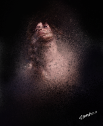
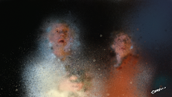
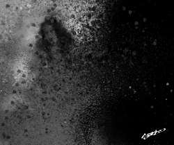
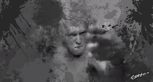
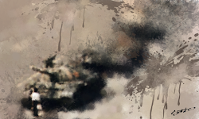
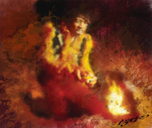
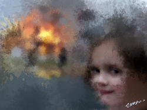

# CODEF_Paint

CODEF_Paint is a tiny painting tool coded using [CODEF](https://codef.santo.fr)

## Usage
- Mouse scroll : Change brush size
- Mouse scroll + Shift :  Brush rotation
- Mouse scroll + Alt : Change brush
- Left Click : Draw
- Middle Click : View Original image
- Right Click : pick a color ( for fixed color mode )

## Some work done with it

## Demo
[HERE](https://n0namen0.github.io/CODEF_Paint/)

## License
[MIT](https://choosealicense.com/licenses/mit/)